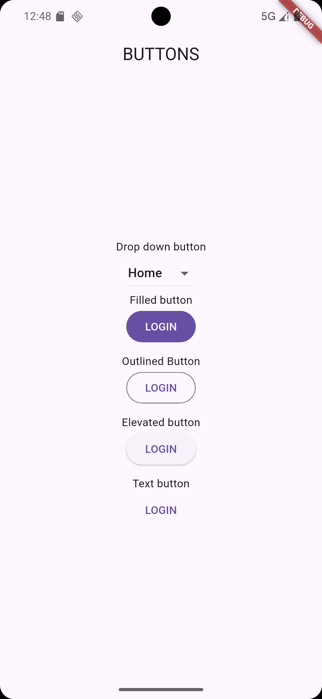

# Buttons & Dropdown App

A simple Flutter application demonstrating the use of buttons and a dropdown menu.

## Features

- **Dropdown Button** to select options dynamically.
- **Various Button Types** (`FilledButton`, `OutlinedButton`, `ElevatedButton`, `TextButton`).
- Uses `setState` to update the selected dropdown item.

## Screenshot



## Installation

1. Clone the repository:
   ```bash
   git clone https://github.com/yourusername/buttons-dropdown-app.git
