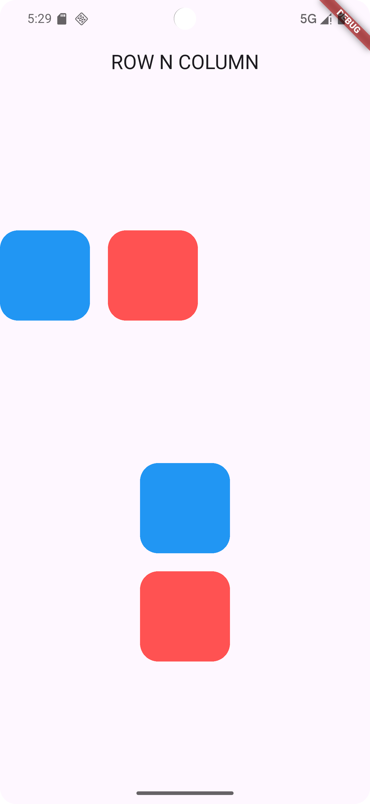

# 📐 Flutter Row & Column Layout App

A clean and minimal Flutter app demonstrating the use of `Row` and `Column` widgets to build structured layouts using containers. Perfect for beginners looking to understand Flutter's layout system.

---

## ✨ Features

- 🧱 **Row Widget** for horizontal layouts
- 🏗️ **Column Widget** for vertical layouts
- 🎨 **Styled Containers** with rounded corners and distinct colors
- 📏 **SizedBox** for spacing between widgets
- 🧼 Clean and simple UI to focus on layout mechanics

---

## 📸 Screenshot

| Layout Example |
|----------------|
|  |


---

## 🚀 Getting Started

To run this app on your local device:

```bash
git clone <your-repo-url>
cd row_column_app
flutter pub get
flutter run
