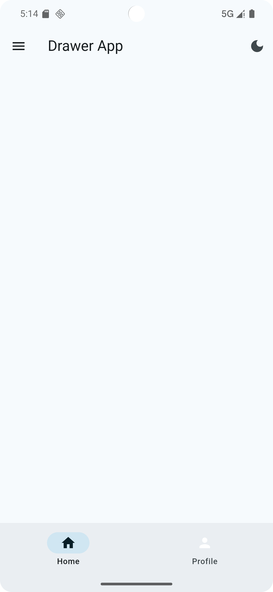
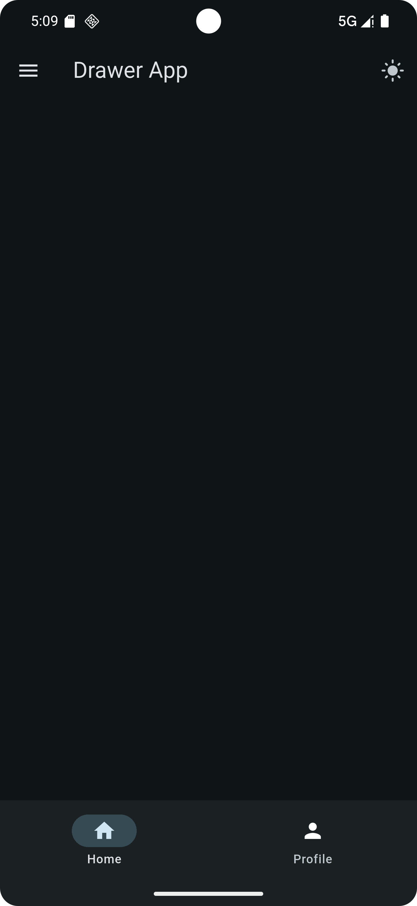

# 📱 Flutter Drawer App

A simple and elegant Flutter app demonstrating how to use a **Drawer Navigation**, implement **theme switching** (Dark/Light Mode), and a **bottom navigation bar** – all in one clean layout.

---

## ✨ Features

- 🧭 Drawer Navigation
- 🌗 Toggle between Light and Dark Mode
- 📱 Bottom Navigation Bar
- 🧑 User info in drawer header
- ⚙️ Clean and modular code

---

## 🎥 Screenshots

| Light Mode | Dark Mode |
|------------|-----------|
|  |  |

> 💡 Add your screenshots in the `screenshots/` folder.

---

## 🛠️ How to Run

1. **Clone the repository**
   ```bash
   git clone https://github.com/your-username/drawer_app.git
   cd drawer_app
