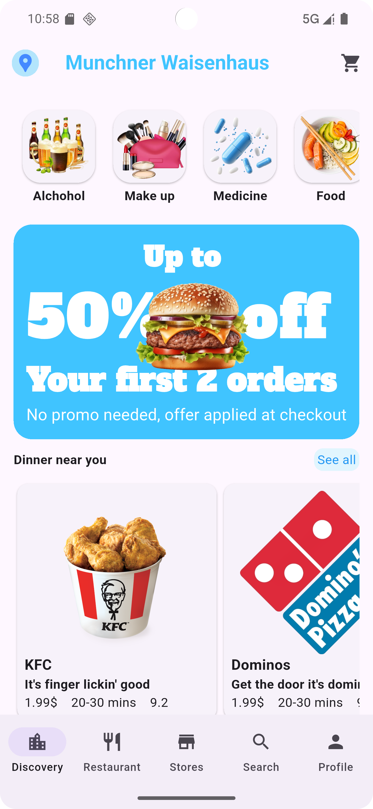

# 🍔 Food App UI

A clean and modern Flutter UI for a food delivery app. This interface displays food categories, nearby restaurants, and special offers, with smooth scrolling and a responsive layout.

---

## ✨ Features

- 📍 Location indicator with app bar
- 🛒 Shopping cart icon
- 🍱 Horizontal scrolling food categories
- 🎉 Offer display section
- 🍔 Nearby restaurants with image, name, and slogan
- 🚀 Bottom navigation bar with discovery, restaurants, stores, search, and profile

---

## 📱 Screenshot

> Replace the image below with an actual screenshot from your app.

---

## 🗂️ Project Structure

