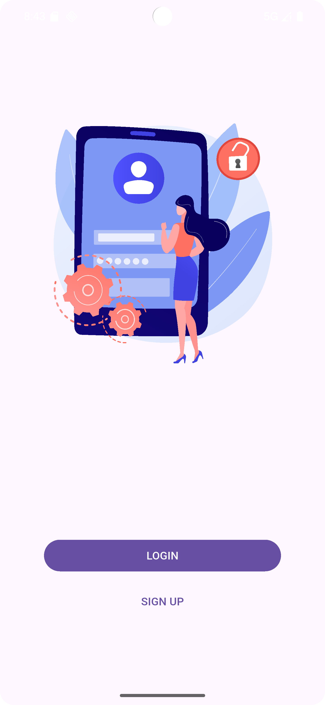

# 📱 Flutter Login Animation Screen

This Flutter project demonstrates:
- Using a **Lottie animation** for login screens.
- Creating a **Login** and **Sign Up** button with custom styling.
- Using **Padding**, **SizedBox**, **ClipRRect** for UI design.

---

## ✨ Features
- **Lottie Animation** displayed at the top (asset from `assets/lotties/login.json`).
- **LOGIN** button:
    - FilledButton with custom width, height, and rounded corners.
- **SIGN UP** button:
    - TextButton with a similar style.
- Modern and responsive UI built with `Column` and `Center`.

---

## 🛠 Technologies Used
- **Flutter** (SDK)
- **Material Design** widgets:
    - `Scaffold`
    - `Center`
    - `Column`
    - `FilledButton`
    - `TextButton`
    - `Padding`
    - `ClipRRect`
- **Lottie animations** via [lottie](https://pub.dev/packages/lottie) package

---

## 📸 Screenshot



_(Save your screenshot as `assets/images/img.png` to link correctly.)_

---

## 📂 How to Run

1. Install the Flutter SDK.
2. Add the **Lottie** package if not yet added:

```bash
flutter pub add lottie
