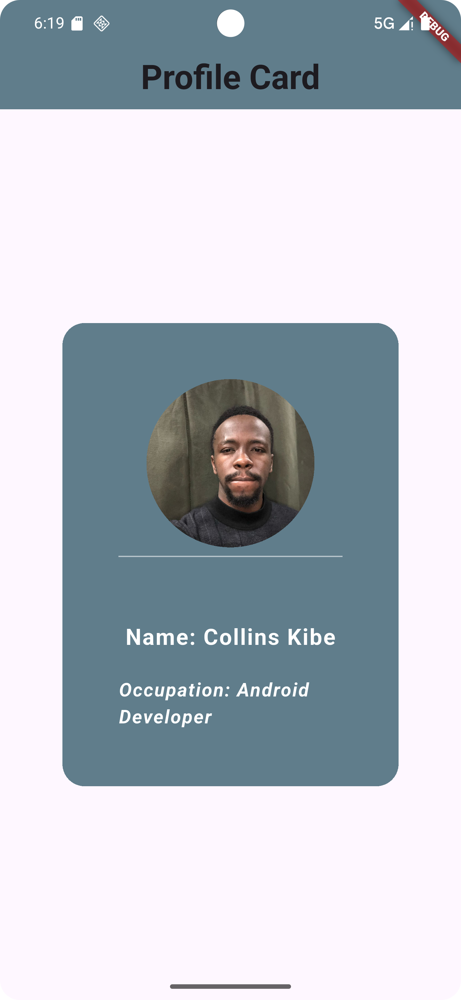

# 👤 Profile Card UI (Flutter)

This project is a simple **Profile Card UI** built using **Flutter**. It showcases a profile card with an image, user name, and occupation details, making use of **Container**, **ClipOval**, **Text**, and **Divider** widgets to create a visually appealing layout.

---

## ✨ Features

- **Profile Picture** displayed in a circular shape using `ClipOval`.
- **User Name** and **Occupation** displayed with custom text styling.
- **Divider** between elements for a neat layout.
- **AppBar** with a centered title.

---

## 📸 Screenshot

---

## 🛠️ Tech Stack

- **Flutter** (UI toolkit)
- **Dart** (Programming Language)
- **Material Design** components

---

## 📂 Assets Used

- Profile picture loaded from:
