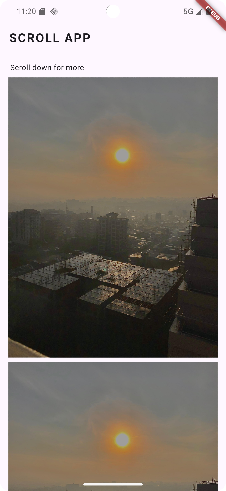

# Scroll App

A simple Flutter application demonstrating the use of `SingleChildScrollView` to allow scrolling through multiple images.

## Features

- Displays a list of images.
- Allows vertical scrolling.
- Includes a title with styled text.

## Screenshot



## Installation

1. Clone the repository:
   ```bash
   git clone https://github.com/yourusername/scroll-app.git
