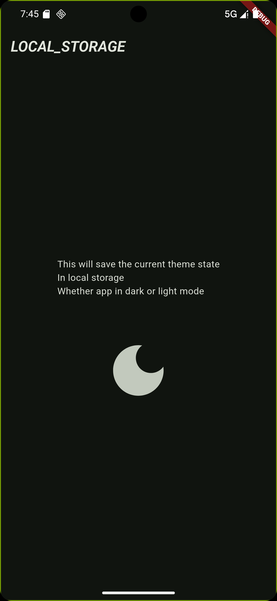

# 🌓 Flutter Shared Preferences Theme Toggle

This is a simple Flutter app demonstrating how to use `SharedPreferences` to store and retrieve the user's theme mode preference (light or dark mode).

## 🚀 Features

- Toggle between **Light Mode** and **Dark Mode**
- Save the theme mode using `SharedPreferences`
- Restore the last selected theme mode on app restart
- Uses `ValueNotifier` + `ValueListenableBuilder` for reactive UI updates

## 🖼 Screenshot

<!-- Replace this with your image -->


## 🧠 How It Works

- A global `ValueNotifier<bool>` named `isDarkModeOn` stores the current theme state.
- When the user taps the dark mode icon, the theme is toggled and saved locally.
- On app start, the saved preference is loaded using `SharedPreferences` in `initState`.

### 🌙 Toggling Theme

```dart
isDarkModeOn.value = !isDarkModeOn.value;
final prefs = await SharedPreferences.getInstance();
await prefs.setBool('themeMode', isDarkModeOn.value);
