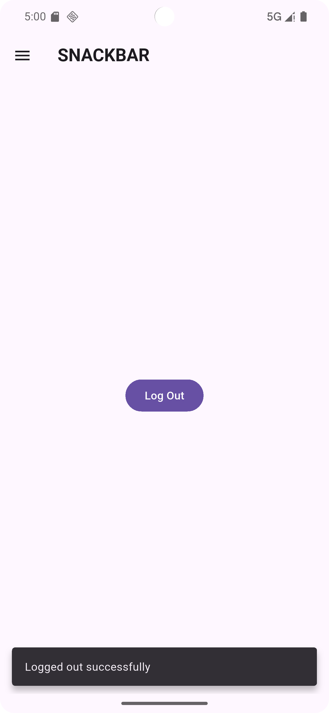

# 📱 Flutter Snackbar & Drawer Example

This Flutter project demonstrates:
- Using a **Drawer** with a **DrawerHeader** and **ListTile** items.
- Showing a **Snackbar** when the user logs out.
- Closing the Drawer automatically when an item is tapped.

---

## ✨ Features
- **Drawer** with user's name (`Collins Kibe`) in the header.
- **Logout** ListTile inside the Drawer:
    - Closes the Drawer when tapped.
    - Displays a floating Snackbar with the message: _"Logged out successfully"_.
- **FilledButton** on the main screen body:
    - Shows the same Snackbar when pressed.
- Clean UI with `AppBar`, `Drawer`, and centered button.

---

## 🛠 Technologies Used
- **Flutter** (SDK)
- **Material Design** widgets:
    - `Scaffold`
    - `AppBar`
    - `Drawer`
    - `DrawerHeader`
    - `ListTile`
    - `SnackBar`
    - `FilledButton`
    - `GestureDetector`

---

## 📸 Screenshot



---

## 📂 How to Run
1. Make sure Flutter SDK is installed.
2. Clone or download this project.
3. Run the following commands:

```bash
flutter pub get
flutter run
