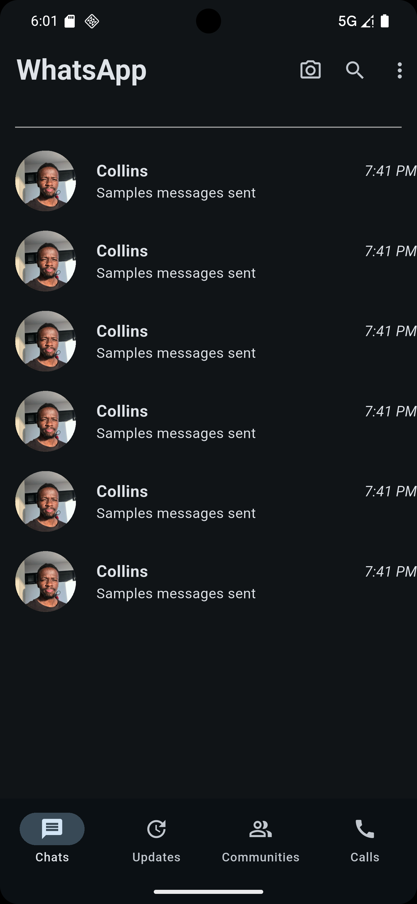

# 📱 WhatsApp UI Clone (Flutter)

This project is a simple **WhatsApp UI clone** built using **Flutter**. It mimics the main screen layout of WhatsApp, showcasing tabs like **Chats**, **Updates**, **Communities**, and **Calls**, complete with icons, profile pictures, and dummy messages.

---

## ✨ Features

- 🧭 **Bottom Navigation Bar** with:
    - Chats
    - Updates
    - Communities
    - Calls
- 📱 **AppBar** with:
    - WhatsApp title
    - Camera, Search, and More icons
- 👤 **Chat list mockup**:
    - Profile picture
    - Contact name
    - Sample last message
    - Time stamp

---

## 📸 Screenshot

---

## 🛠️ Tech Stack

- **Flutter** (UI toolkit)
- **Dart** (Programming Language)
- **Material Design** components

---

## 📂 Assets Used

- Profile picture loaded from self
